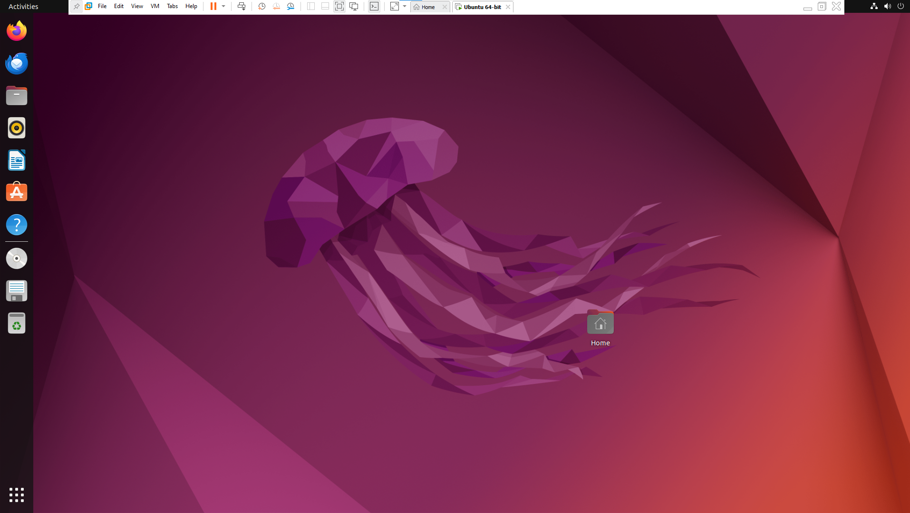
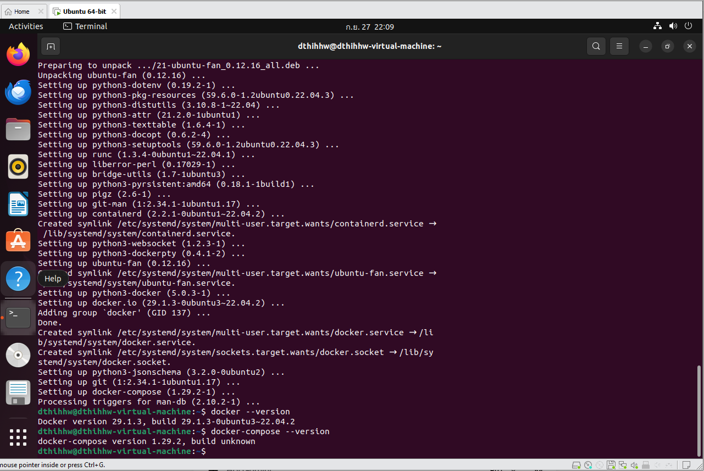
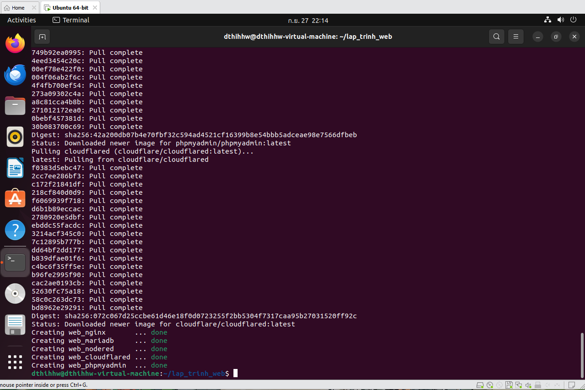
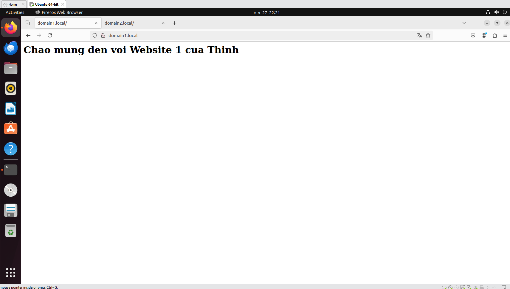
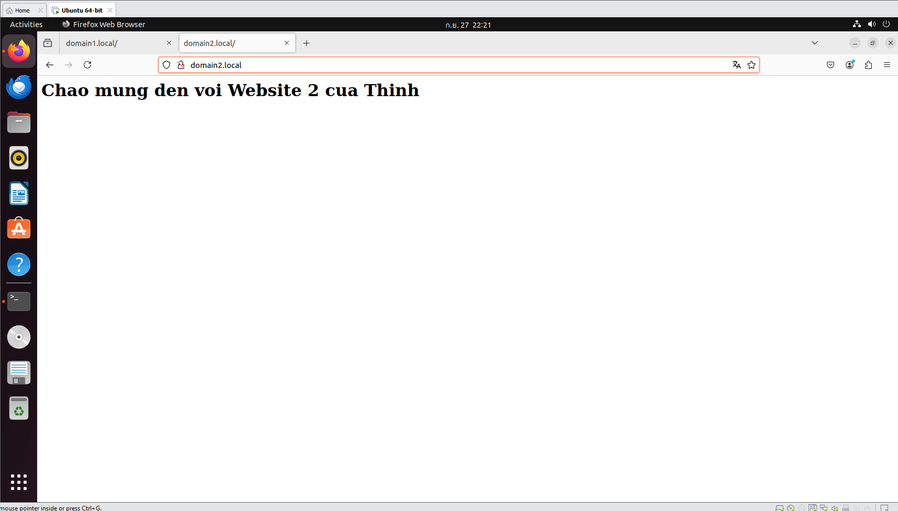
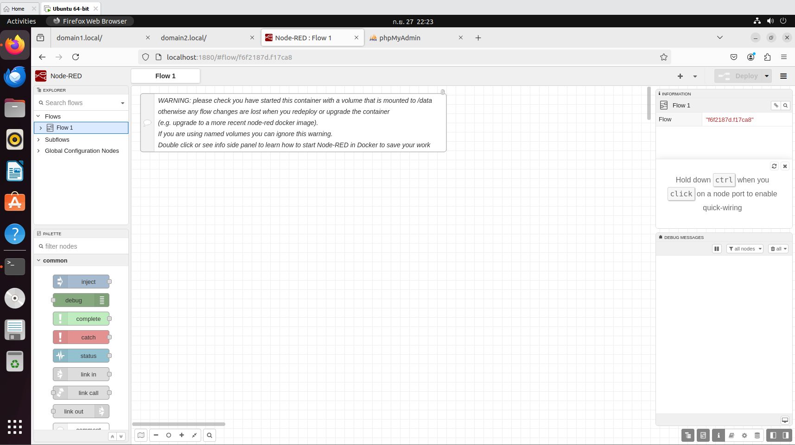
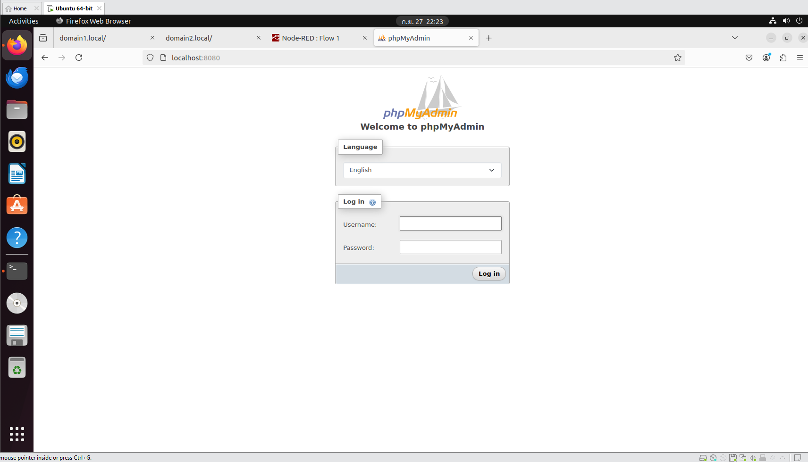

# Báo cáo Bài tập: Triển khai hệ thống Web bằng Docker

## 1. Thông tin sinh viên
- **Họ và tên:** Nguyễn Đăng Thịnh
- **MSSV:** k235480106069
- **Email:** k235480106069@tnut.edu.vn

## 2. Mô tả dự án
Dự án thực hành thiết lập môi trường giả lập Linux trên Windows thông qua VMware và triển khai hệ thống đa dịch vụ bằng Docker Compose. Cấu trúc hệ thống bao gồm:
- **Nginx:** Máy chủ web và Reverse Proxy cấu hình định tuyến cho 2 tên miền độc lập.
- **Node-RED:** Môi trường lập trình trực quan (chạy cổng 1880).
- **MariaDB & phpMyAdmin:** Hệ quản trị cơ sở dữ liệu và giao diện web quản lý (chạy cổng 8080).
- **Cloudflared:** Đường hầm bảo mật kết nối mạng (Tunnel).

## 3. Quá trình thực hiện và Kết quả
**3.1. Cài đặt hệ điều hành Ubuntu trên máy ảo VMware**

**3.2. Cài đặt thành công Docker và Docker Compose**

**3.3. Khởi tạo đồng loạt 5 dịch vụ bằng file docker-compose.yml**

**3.4. Cấu hình Nginx định tuyến thành công 2 tên miền ảo**

**3.5. Kiểm tra hoạt động của Node-RED và phpMyAdmin**

