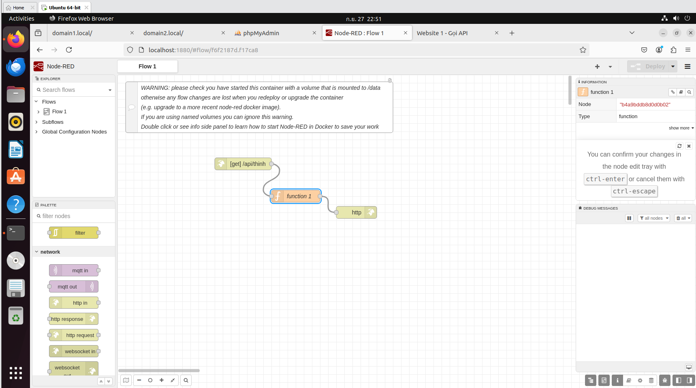
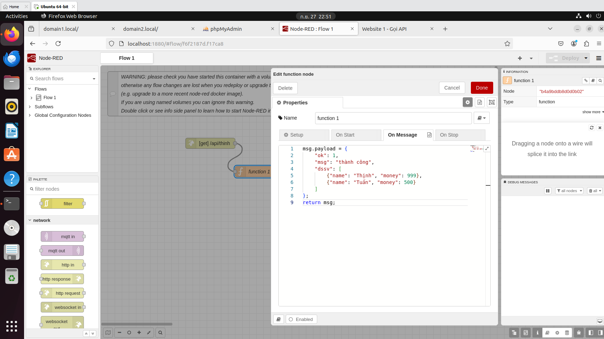
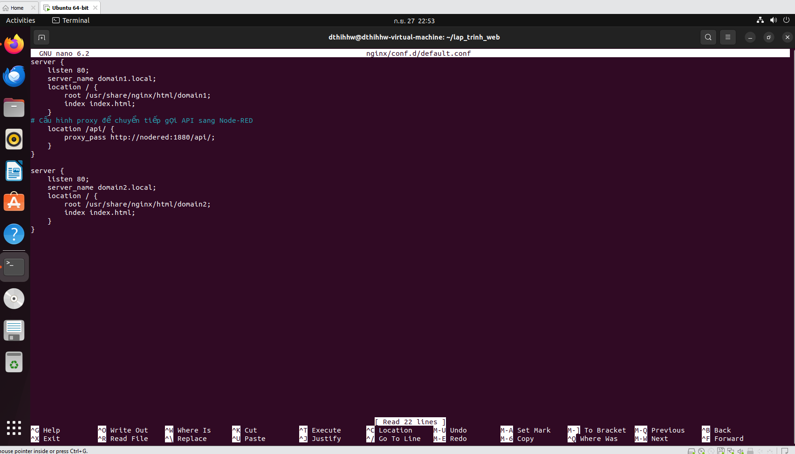
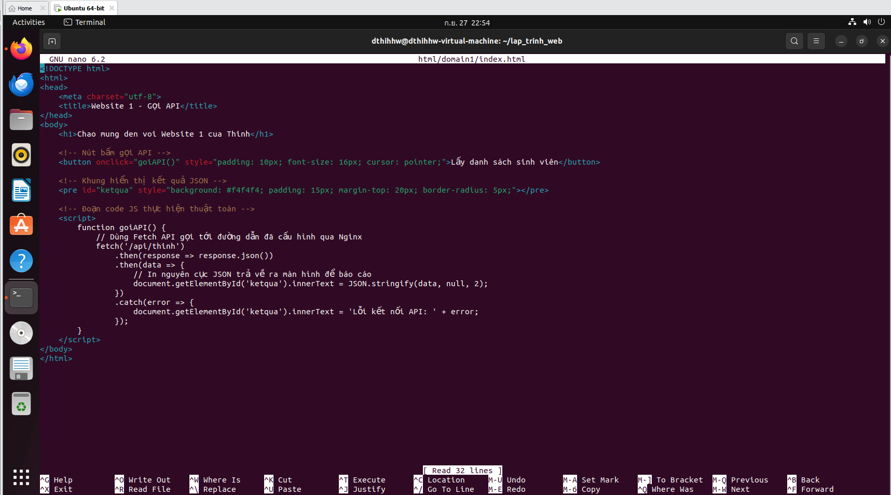
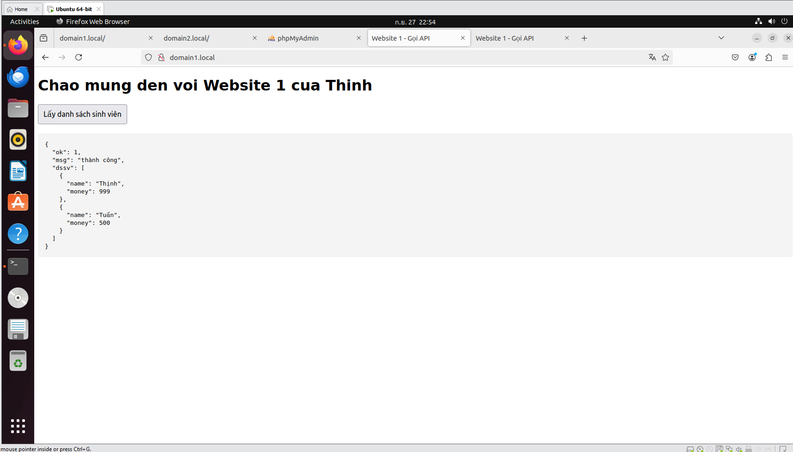

# Báo cáo Bài tập 2: Tích hợp API Node-RED vào Nginx và gọi bằng Javascript

## Yêu cầu 1: Tạo API đơn giản trên Node-RED
Sử dụng các node `http_in`, `function` và `http_response` để tạo một API tại đường dẫn `/api/thinh` trả về chuỗi JSON chứa danh sách sinh viên.

## Yêu cầu 2: Cấu hình Nginx định tuyến API
Chỉnh sửa file cấu hình `default.conf` của Nginx, thêm `location /api/` để làm Reverse Proxy, chuyển tiếp các request gọi API từ web (port 80) sang Node-RED (port 1880) nhằm tránh lỗi CORS.

## Yêu cầu 3: Code Javascript gọi API trên trang HTML
Viết mã HTML và JS (sử dụng Fetch API) tại trang chủ `domain1.local` để bắt sự kiện click chuột và hiển thị dữ liệu JSON lấy được từ Backend.

## Kết quả hoạt động
Trang web gọi API thành công và render dữ liệu JSON trực tiếp lên màn hình mà không cần tải lại trang.
